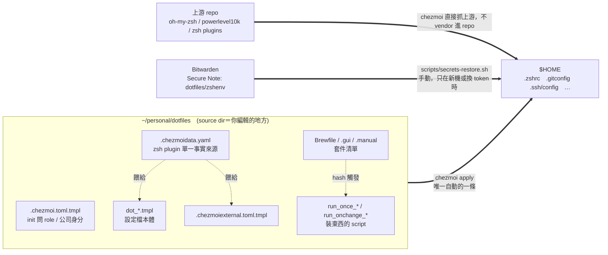

# dotfiles

chezmoi + Homebrew。一台新 Mac 從開機到能寫程式，三個指令。

**這是 public repo，裡面沒有任何 secret。**

| 想知道 | 看這裡 |
|---|---|
| 怎麼做（更新、換機、apply、出事怎麼查） | [`docs/RUNBOOK.md`](docs/RUNBOOK.md) |
| 為什麼這樣設計 | [`docs/DECISIONS.md`](docs/DECISIONS.md) |
| 裝了什麼、為什麼不裝別的、移除紀錄 | [`docs/INVENTORY.md`](docs/INVENTORY.md) |

---

# Quick start

## A. 新機器

```bash
# ① 系統底座
xcode-select --install
/bin/bash -c "$(curl -fsSL https://raw.githubusercontent.com/Homebrew/install/HEAD/install.sh)"

# ② 一行搞定 dotfiles（會問 3 個問題，見下面）
sh -c "$(curl -fsLS get.chezmoi.io)" -- init --apply --source=~/personal/dotfiles rammusxu

# ③ 補 secret
export BW_SESSION=$(bw unlock --raw)
~/personal/dotfiles/scripts/secrets-restore.sh
```

② 結束時會印出一份「chezmoi 管不到的」待辦清單（SSH key、gh 登入、需要授權的 app…）。
**它只印不失敗** —— bootstrap 不該因為少一個 secret 就整個中斷。

> **`--source` 不能省。** 這個 repo 把 source dir 釘在 `~/personal/dotfiles`，
> 忘了帶的話 chezmoi 會 clone 到預設的 `~/.local/share/chezmoi`，而 config 指向
> `~/personal/dotfiles`（空的）—— 症狀是 `chezmoi managed` 什麼都沒有，而且**不會報錯**。
> 懷疑的時候跑 `make doctor`。

`init` 會問三個問題，答案存在 `~/.config/chezmoi/chezmoi.toml`（在 `$HOME`，不進版控）：

| 問題 | 答法 |
|---|---|
| `role` | `primary` = 日常主力機（裝 GUI app）/ `runner` = 備援背景機（只裝 CLI） |
| `workName` | 公司 git 身分的 name，例：`yourname-company` |
| `workEmail` | 公司 git 身分的 email，例：`you@company.com` |

> 沒有「這台是不是公司電腦」這種問題。**身分由目錄決定**：`~/workspace/` 用公司身分、
> `~/personal/` 用個人身分，每台機器都一樣。兩個目錄以外 `git commit` 會直接報錯
> （`useConfigOnly = true`）—— 寧可報錯，也不要安靜地用錯 email 送出去。

## B. 更新套件

```bash
make update
```

這一個指令做完 brew 套件 + oh-my-zsh/p10k/plugin + gcloud。**GUI app 不用管**
（都是 auto_updates，app 自己更新）。

四種東西的更新路徑不一樣，會搞混的時候看這張表：

| 要更新的 | 指令 |
|---|---|
| brew 套件（CLI） | `make update` |
| oh-my-zsh / p10k / zsh plugin | `make refresh`（平常 168h 自動，這是強制立刻抓） |
| GUI app（cask） | 不用管，app 自己更新 |
| gcloud | `gcloud components update`（`make update` 已含） |
| 這份 dotfiles 本身 | `make pull`（= git pull + apply） |

**加套件**：編輯 `Brewfile`（CLI）或 `Brewfile.gui`（GUI），`make apply`。
改了 Brewfile 不用手動跑 brew bundle，apply 會自己重跑。

**減套件**：從 Brewfile 拿掉那一行。注意這**不會**解除安裝 ——
`make audit` 看差在哪，`make prune` 產生 uninstall 指令（dry-run）。

## C. 改設定

```bash
chezmoi edit ~/.zshrc                 # 改 source 檔，不是直接改 ~/.zshrc
chezmoi diff && make quick            # 先看，再套用
cd $(chezmoi source-path) && git add -A && git commit && git push
```

`chezmoi re-add` **只在主力機做** —— 兩台都 re-add + push 就會開始打架。

## 我該打哪個指令

直接跑 `make` 會列出全部。常用的：

| 指令 | 做什麼 |
|---|---|
| `make doctor` | **出事先跑這個**：檢查 source-path / config / secrets 有沒有接對 |
| `make diff` | 看 apply 會改什麼（動手前先跑） |
| `make quick` | 日常套用，跳過 externals，最快 |
| `make apply` | 完整套用 |
| `make update` | 更新所有套件 |
| `make audit` | 機器實際狀態 vs Brewfile |
| `make prune` | 列出多裝的東西並產生 uninstall 指令 |
| `make secrets` | 從 Bitwarden 還原 `~/.zshenv` |

---

# 這個 repo 怎麼組起來的

## 編輯位置只有一個

**`~/personal/dotfiles`。** 這裡同時是你 `git` 編輯的地方，也是 chezmoi 的 source dir。

chezmoi 預設會把 source dir 放在 `~/.local/share/chezmoi`。如果編輯在一處、
執行在 `.local/share`，就會變成同一個 repo 有兩份 clone —— `chezmoi add` / `re-add`
會寫進「執行」那一份，你在「編輯」那一份卻看不到，兩邊開始漂移。這是最容易出錯的地方。

所以 `.chezmoi.toml.tmpl` 用 `sourceDir` 把它指回 `~/personal/dotfiles`，
`chezmoi edit` / `add` / `re-add` / `apply` 全部作用在同一份。`make doctor` 會驗這件事。

## 三種東西流進 `$HOME`

只有第一種在這個 repo 裡：


```mermaid
flowchart LR
    subgraph SRC["~/personal/dotfiles　(source dir＝你編輯的地方)"]
        direction TB
        CFG[".chezmoi.toml.tmpl<br/>init 問 role / 公司身分"]
        DATA[".chezmoidata.yaml<br/>zsh plugin 單一事實來源"]
        EXT[".chezmoiexternal.toml.tmpl"]
        TMPL["dot_*.tmpl<br/>設定檔本體"]
        BREW["Brewfile / .gui / .manual<br/>套件清單"]
        RUN["run_once_* / run_onchange_*<br/>裝東西的 script"]
        DATA -. 餵給 .-> TMPL
        DATA -. 餵給 .-> EXT
        BREW -. hash 觸發 .-> RUN
    end
    UP["上游 repo<br/>oh-my-zsh / powerlevel10k / zsh plugins"]
    BW["Bitwarden<br/>Secure Note: dotfiles/zshenv"]
    HOME["$HOME<br/>.zshrc　.gitconfig　.ssh/config　…"]

    SRC ==>|chezmoi apply<br/>唯一自動的一條| HOME
    UP ==>|chezmoi 直接抓上游，不 vendor 進 repo| HOME
    BW ==>|scripts/secrets-restore.sh<br/>手動，只在新機或換 token 時| HOME
```

檔案本身：

```text
~/personal/dotfiles/
│
├── .chezmoi.toml.tmpl              init 問 role / workName / workEmail，並把 sourceDir 釘在這裡
├── .chezmoidata.yaml               ★ zsh plugin 清單的單一事實來源
│                                     .zshrc 的 plugins=() 與 external 下載清單都從這產生
├── .chezmoiexternal.toml.tmpl      oh-my-zsh、powerlevel10k、zsh plugins 由 chezmoi 抓上游
├── .chezmoiignore                  擋掉 repo-only 檔案（README/scripts/docs…）不被 apply 到 $HOME
├── .chezmoiremove                  列在這裡的 target 會在 apply 時從 $HOME 移除（清舊檔）
│
│                                   ── 設定檔本體：改設定改這裡，不要直接改 $HOME ──
├── dot_zprofile.tmpl               → ~/.zprofile：PATH 與環境變數（登入 shell）
├── dot_zshrc.tmpl                  → ~/.zshrc：oh-my-zsh、plugin、alias、補完、prompt
├── dot_p10k.zsh                    → ~/.p10k.zsh（role=runner 不裝）
├── dot_gitconfig.tmpl              → ~/.gitconfig：只有 includeIf 規則，沒有預設身分
├── dot_gitconfig-work.tmpl         → 公司身分，值來自 chezmoi.toml（不在這個 repo 裡）
├── dot_gitconfig-personal.tmpl     → 個人身分
├── dot_gitignore_global.tmpl       → ~/.gitignore_global
├── private_dot_ssh/
│   └── private_config.tmpl         → ~/.ssh/config：host alias（github-work/personal），沒有私鑰
│
│                                   ── 套件清單（詳見 docs/INVENTORY.md）──
├── Brewfile                        CLI 工具，兩種 role 都裝
├── Brewfile.gui                    GUI cask，只有 role=primary 裝（每項標注 tap / binary 來源）
├── Brewfile.manual                 需要 sudo / MAS / 非 brew 的東西 —— 不會自動執行
├── Brewfile.unmanaged              機器上刻意留著但不進「新機要裝」清單 —— 只有 prune 會讀
│
│                                   ── apply 時跑的 script，數字＝順序 ──
├── run_once_after_05-setup-repo-hooks.sh.tmpl      把 core.hooksPath 指到 .githooks
├── run_onchange_after_10-brew.sh.tmpl              brew bundle，含 Brewfile hash 觸發行
├── run_onchange_after_20-macos-defaults.sh.tmpl    macOS 系統偏好
├── run_once_after_30-install-gcloud.sh.tmpl        gcloud 官方 archive 安裝
├── run_once_after_40-bootstrap-checklist.sh.tmpl   印待辦清單，只印不失敗
│
│                                   ── 給人跑的，不會 apply 到 $HOME ──
├── Makefile                        `make` 列出所有指令
├── scripts/
│   ├── lib-brewfile.sh             audit / prune 共用的解析邏輯
│   ├── brewfile-audit.sh           機器實際狀態 vs Brewfile（唯讀）
│   ├── brew-prune.sh               清掉沒宣告的套件（預設 dry-run）
│   ├── secrets-backup.sh           ~/.zshenv → Bitwarden
│   ├── secrets-restore.sh          Bitwarden → ~/.zshenv
│   └── macos-defaults-dump.sh      舊機 dump 系統偏好當參考
├── .githooks/pre-commit            四層檢查，擋 secret 與上游依賴進 public repo
└── docs/
    ├── RUNBOOK.md                  怎麼做
    ├── DECISIONS.md                為什麼
    └── INVENTORY.md                裝了什麼

上游的 oh-my-zsh / p10k / plugin 內容【不在這裡】—— 這個 repo 只有清單。
```

## Secrets：`~/.zshenv` + Bitwarden

**secret 完全不進 repo**，一個字都不進（含加密後的密文，理由見 DECISIONS）。
值放在 `~/.zshenv`，備份放在 Bitwarden 的 Secure Note（item 名稱 `dotfiles/zshenv`）。

為什麼是 `~/.zshenv` 而不是自訂的 `~/.env`：這是 zsh 的慣例位置 —— zsh 會在
**每個** shell 啟動時、比 `.zshrc` 更早自動讀它，不需要任何手動 `source`，
非互動式的 `zsh -c` 也吃得到。

zsh 的三個檔案分工，混了就會出現「明明設了卻沒生效」：

| 檔案 | 什麼時候讀 | 放什麼 | 進版控？ |
|---|---|---|---|
| `~/.zshenv` | **每個** shell，最早 | secret / token | ❌ 走 Bitwarden |
| `~/.zprofile` | 登入 shell | PATH、環境變數 | ✅ |
| `~/.zshrc` | 互動式 shell | oh-my-zsh、plugin、alias、函式、補完、prompt | ✅ |

> 2026-09 之前這裡繞了 `~/.common_env` + `~/.bash_alias` 兩層，而 `~/.bashrc` 存在的
> 唯一理由就是去 source `~/.common_env`。實際上只用 zsh，所以全部合併掉了 ——
> 舊檔由 `.chezmoiremove` 在 apply 時自動清除。

三層保險確保它不會進版控：`.chezmoiignore` 擋 `chezmoi add`、全域 gitignore 擋
`git add`、`.githooks/pre-commit` 擋 commit。

```bash
export BW_SESSION=$(bw unlock --raw)     # 三個操作都要先解鎖

make secrets-save                        # ① 改完 / 加了新 token → 存回 Bitwarden
make secrets                             # ② 新機或別台機器 → 拉回來（會先 bw sync）
bw get notes dotfiles/zshenv | diff - ~/.zshenv    # ③ 只想看跟遠端差在哪
```

① 刻意不自動寫入 Bitwarden，只印出「貼進哪個 Secure Note」的指示 ——
整份 secret 不經過 shell history 和 process list。
② 會把舊檔備份成 `~/.zshenv.bak.<timestamp>`，寫入後 `chmod 600`，開新 shell 生效。

兩支 script 都吃參數（`secrets-restore.sh <item> <目標檔>`），要分公司/個人兩份 note 時直接用。

## SSH：不產生 key，但會覆蓋 `~/.ssh/config`

**這個 repo 不會產生任何 SSH key，也不會動到既有的 key。** 整包沒有一處執行
`ssh-keygen` —— bootstrap 檢查清單只是把指令**印出來**給你自己決定要不要跑。
`~/.ssh/` 底下的私鑰、公鑰、`known_hosts` 全部不在 chezmoi 的管理範圍。

**但 `~/.ssh/config` 本身是 chezmoi 管的，apply 會整份覆蓋。**
手改過的內容要先搬進 `private_dot_ssh/private_config.tmpl`，不然會被蓋掉。
（chezmoi 偵測到那個檔案在它上次寫入之後被改過時會先問你，除非帶 `--force`。）

key 的**檔名**不寫在這個 public repo 裡，預設用慣例名稱：

| 用途 | 預設檔名 | 覆寫用的 key |
|---|---|---|
| 公司（GitHub） | `~/.ssh/id_ed25519_work` | `sshKeyWork` |
| 公司（GitLab） | 同上 | `sshKeyWorkGitlab` |
| 個人 | `~/.ssh/id_ed25519_personal` | `sshKeyPersonal` |

舊機器的 key 如果叫別的名字，在 `~/.config/chezmoi/chezmoi.toml` 的 `[data]`
底下設對應的值就好（那個檔在 `$HOME`，不進版控）。

**不帶 alias 的 URL 預設走公司身分。** 因為實際盤點下來 26 個 repo 有 25 個用的是
`git@github.com:…` 這種不帶 alias 的 URL，其中 20 個是公司 repo。個人 repo 一律用
`github-personal` alias：

```bash
git remote set-url origin git@github-personal:RammusXu/repo.git
ssh -T git@github-personal    # 驗證：應該回 Hi <你的個人帳號>
```

## 換機待辦（chezmoi 管不到的）

- [ ] `~/.zshenv`：`make secrets`（**刻意不進版控**）
- [ ] 公司 git 身分：`git -C ~/workspace/任一repo config user.email` 不該是 `you@company.com`
- [ ] `gh auth login`（選 HTTPS）→ `gh auth setup-git`
- [ ] SSH key：新機產新的並上傳，舊 key 留在舊機。
      remote 用 host alias（`git@github-work:...`），身分才不會打架
- [ ] `Brewfile.manual` 裡的項目（Docker Desktop 授權、Rectangle 輔助使用權限、Xnip、Orca）
- [ ] `Brewfile.unmanaged` 裡想帶過去的 app（不會自動裝）
- [ ] 2FA / Authenticator 轉移
- [ ] VS Code：開 Settings Sync，或 `code --list-extensions` 手動補
- [ ] Obsidian vault 與 `.obsidian/` plugin 設定
- [ ] Dock 排列、輸入法 —— 手動排，不用 script

## 兩台機器的同步紀律

**主力機是唯一的 source of truth。**

- 主力機：`chezmoi add` / `re-add` → commit → push
- 備援機：**只** `make pull`，不 re-add、不 push

兩台都往上推，遲早會遇到不想在半夜 debug 的 merge conflict。
