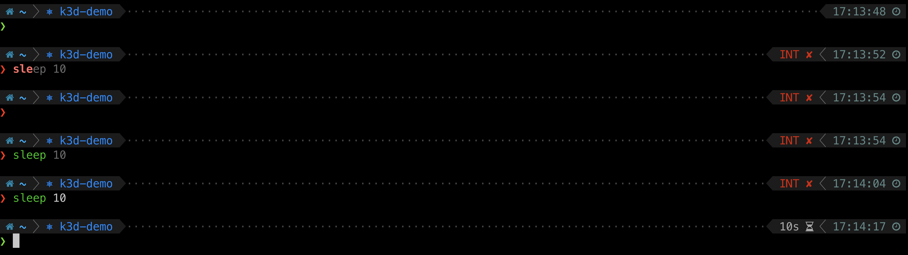

# dotfiles




## Install

```
sh -c "$(curl -fsLS git.io/chezmoi)"
```

雖然也可以用 `brew install chezmoi` 安裝，但是有可能是新的機器，或是 Linux 機器，為了一致性，所以都用 `curl` 安裝。

> If you already have a dotfiles repo using chezmoi on GitHub at `https://github.com/<github-username>/dotfiles` then you can install chezmoi and your dotfiles with the single command:

```
sh -c "$(curl -fsLS git.io/chezmoi)" -- init --apply rammusxu
```

## Setup project


1. 開新的 Git repo: https://github.com/new ，取名叫 dotfiles。

2. 初始化本地的 chezmoi
    ```
    chezmoi init --apply rammusxu
    ```

### Get/Update oh-my-zsh

不要開啟 .oh-my-zsh 的自動更新，不然 git commit 會很亂。

https://github.com/twpayne/chezmoi/blob/master/docs/HOWTO.md#include-a-subdirectory-from-another-repository-like-oh-my-zsh

```bash
curl -s -L -o oh-my-zsh-master.tar.gz https://github.com/robbyrussell/oh-my-zsh/archive/master.tar.gz
mkdir -p $(chezmoi source-path)/dot_oh-my-zsh
chezmoi import --strip-components 1 --destination ${HOME}/.oh-my-zsh oh-my-zsh-master.tar.gz
```

### Change ZSH_CUSTOM folder

不要用 `.oh-my-zsh/custom` 當作預設，因為更新 `.oh-my-zsh` 的時候會被覆蓋掉。

`dot_zshrc.tmpl`
```
ZSH_CUSTOM="{{ .chezmoi.homeDir }}/.omz-custom"
```

## iterm

> Credit: https://apple.stackexchange.com/questions/136928/using-alt-cmd-right-left-arrow-in-iterm/136931

Preferences -> Profiles -> Keys -> Presets: `Natural Text Editing`


## Update
```bash
chezmoi update
```

### Add brew formula|cask

https://www.chezmoi.io/docs/how-to/#use-chezmoi-on-macos

Edit `run_once_before_20-brew-darwin.sh.tmpl`


### Add new file
```
chezmoi add ~/.zsh_alias.zsh
chezmoi add --autotemplate ~/.zsh_alias.zsh
```

### Add custom plugin
```
NEW_PLUGIN=chezmoi
NEW_PLUGIN_PATH=$(chezmoi source-path)/dot_omz-custom/plugins/$NEW_PLUGIN

mkdir -p $NEW_PLUGIN_PATH
chezmoi completion zsh > $NEW_PLUGIN_PATH/_$NEW_PLUGIN
```

### Add oh-my-zsh theme
```
git clone --depth=1 https://github.com/romkatv/powerlevel10k.git ${ZSH_CUSTOM}/themes/powerlevel10k
chezmoi add -r ${ZSH_CUSTOM}
chezmoi cd
git add dot_omz-custom
```

Set ZSH_THEME="powerlevel10k/powerlevel10k" in `~/.zshrc`.


## Visual Studio Code

Visual Studio Code: Open File → Preferences → Settings, enter terminal.integrated.fontFamily in the search box and set the value to MesloLGS NF.
